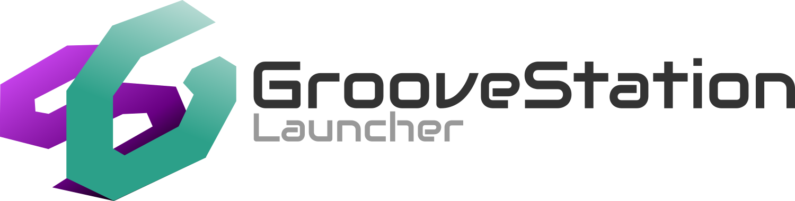

# GrooveStationLauncher


# 🎮 GrooveStation

> A fully-featured arcade game launcher for Windows, designed specifically for dedicated rhythm game cabinets and arcade systems.

[](https://opensource.org/licenses/MIT)
[](https://www.electronjs.org/)
[](https://www.microsoft.com/windows)

## 📖 Overview

GrooveStation is a custom game launcher built for dedicated arcade PCs and rhythm game cabinets. Whether you're building a home multi-game arcade setup, GrooveStation provides a polished interface that turns your PC into a true arcade experience.

**Designed for dedicated systems**, GrooveStation can completely replace the Windows desktop environment, offering kiosk mode functionality that hides the taskbar and desktop, auto-starts with Windows, and provides full keyboard/controller navigation. No mouse required - perfect for cabinets with arcade controls.

The launcher features a visual carousel for game selection, random background videos, customizable music, and a built-in configurator so you never have to manually edit config files. Everything is designed to work seamlessly on systems that boot directly into the launcher, making it ideal for arcade cabinets that should "just work" when powered on.

**Perfect for:**
- Home rhythm game cabinets (DDR, StepMania, ITG, PIU)
- Multi-game arcade setups
- DJMAX, beatmania IIDX, and other rhythm game installations
- Any PC that should boot directly into games without showing Windows

## ✨ Features

### Launcher Interface
- **Visual Game Carousel** - Navigate games with arrow keys, infinite circular scrolling
- **Dual Executable Support** - Launch up to 2 executables per game (.exe, .lnk, .bat)
- **Random Background Videos** - Multiple videos rotate automatically for variety
- **Background Music Playlist** - Custom music with adjustable volume (0-100%)
- **System Menu** - Quick access to shutdown, restart, configurator, custom programs
- **Hidden Cursor** - Mouse cursor automatically hides for immersive experience
- **Auto-minimize** - Launcher minimizes when games launch, restores on exit
- **Animated Navigation** - Smooth transitions with blur effects and scaling

### Visual Configurator
- **Easy Game Management** - Add, remove, enable/disable games through GUI
- **Media Configuration** - Manage videos, music, sounds, and volume
- **Image Previews** - See game logos in real-time (max 200px thumbnails)
- **System Options** - Configure auto-start and kiosk mode with checkboxes
- **Save/Cancel Buttons** - Revert changes or apply instantly
- **Auto-close on Save** - Configurator closes after saving for quick workflow

### Kiosk Mode & System Integration
- ✅ **Auto-start with Windows** - Boot directly into launcher
- ✅ **Disable Windows Shell** - Hide taskbar/desktop (kills Explorer.exe)
- 🔄 **Auto-restore Shell** - Explorer returns when launcher closes
- 🎮 **Full Keyboard Navigation** - No mouse needed for cabinet setups
- 📦 **Clean Uninstall** - Removes all traces including AppData

### Installer Features
- **NSIS-based Setup** - Standard Windows installer with custom options
- **Assets Included** - All default images, music, and videos bundled
- **Pre-configured Defaults** - StepMania example game with working media
- **Desktop + Start Menu Shortcuts** - Separate icons for Launcher and Config
- **Finish Page Options** - Launch launcher or configurator immediately after install

## 🚀 Installation

### For End Users (Cabinet Owners)
1. Download `GrooveStation Setup.exe` from [Releases](https://github.com/raulhc3521/GrooveStationLauncher/releases)
2. Run installer, choose installation directory (default: `C:\Program Files\GrooveStation\GrooveStation`)
3. Launch **GrooveStation Launcher** from desktop or start menu
4. Open **GrooveStation Config** to add your games

## 🎮 Usage

### Launcher Controls
- **← →** - Navigate between games
- **↑** - Open system menu
- **↓** - Close system menu
- **Enter** - Launch selected game or execute menu item

### Adding Games to Your Cabinet
1. Open **GrooveStation Config** from the desktop shortcut
2. Click **+ Agregar juego** (Add game)
3. Fill in game name
4. Browse for the main executable (.exe, .lnk, or .bat)
5. (Optional) Browse for a second executable if needed
6. Browse for a game logo/image
7. Click **💾 Guardar cambios** (Save changes)
8. Game appears immediately in the launcher

### System Menu Customization
The system menu can launch executables, run shell commands, or perform actions:
- **Executables**: Browse for any .exe, .lnk, or .bat file
- **Commands**: Enter shell commands (e.g., `shutdown /s /t 0`)
- **Actions**: Built-in actions like "exit" to close the launcher

### Configuration Files Location
After first launch, all configs are stored in `%APPDATA%\GrooveStation\config\`:
- `games.json` - Game list with executables and images
- `media.json` - Background videos, music, sounds, volume settings
- `menu.json` - System menu items, commands, and executables
- `settings.json` - Auto-start and kiosk mode settings

## 🖼️ Screenshots

_Coming soon_


### For Developers
```bash
# Clone repository
git clone https://github.com/raulhc3521/GrooveStationLauncher.git
cd GrooveStationLauncher

# Install dependencies
npm install

# Run in development
npm run launcher  # Run launcher
npm run config    # Run configurator

# Build installer
npm run build:win
```

## 📁 Project Structure
```
GrooveStationLauncher/
├── assets/              # Images, music, videos, sounds
├── config/              # Default configuration (games, media, menu)
├── public/
│   ├── launcher/        # Launcher UI (HTML, CSS, JS)
│   └── configurator/    # Configurator UI (HTML, CSS, JS)
├── installer-scripts/   # NSIS custom installer script
├── main-launcher.js     # Launcher main process
├── main-configurator.js # Configurator main process
├── ipc-config.js        # IPC handlers for config management
├── preload.js           # Bridge between renderer and main
└── package.json         # Build configuration
```


## 🛠️ Building from Source

### Requirements
- Node.js 16 or higher
- Windows 10/11
- Git

### Build Steps
```bash
# Install dependencies
npm install

# Create Windows installer
npm run build:win

# Output: dist/GrooveStation Setup X.X.X.exe
```

The installer will be approximately 100-150MB and includes all assets (images, music, videos).

## 📋 Configuration Examples

### games.json
```json
[
  {
    "id": "stepmania",
    "name": "StepMania 5",
    "exe": "C:\\Games\\Stepmania 5\\Program\\Stepmania.exe",
    "exe2": "",
    "image": "C:\\Program Files\\GrooveStation\\resources\\assets\\images\\stepmania.png",
    "enabled": true
  },
  {
    "id": "ddr",
    "name": "DDR A3",
    "exe": "C:\\Games\\DDR\\spice64.exe",
    "exe2": "C:\\Games\\DDR\\launcher.exe",
    "image": "C:\\Program Files\\GrooveStation\\resources\\assets\\images\\ddr.png",
    "enabled": true
  }
]
```

### media.json
```json
{
  "music": [
    "C:\\Program Files\\GrooveStation\\resources\\assets\\music\\track1.ogg",
    "C:\\Program Files\\GrooveStation\\resources\\assets\\music\\track2.ogg"
  ],
  "backgroundVideos": [
    "C:\\Program Files\\GrooveStation\\resources\\assets\\video\\bg1.mp4",
    "C:\\Program Files\\GrooveStation\\resources\\assets\\video\\bg2.mp4"
  ],
  "volume": 40,
  "startSound": "C:\\Program Files\\GrooveStation\\resources\\assets\\sounds\\start.ogg"
}
```

### menu.json
```json
[
  { "id": "config", "label": "Configurador", "action": "openConfig" },
  { "id": "explorer", "label": "Explorer", "command": "explorer.exe" },
  { "id": "shutdown", "label": "Apagar", "command": "shutdown /s /t 0" },
  { "id": "restart", "label": "Reiniciar", "command": "shutdown /r /t 0" },
  { "id": "exit", "label": "Cerrar", "action": "exit" }
]
```

## 🎯 Use Cases

### Home Rhythm Game Cabinets
Perfect for dedicated DDR, StepMania, or ITG cabinets. Enable kiosk mode and auto-start to boot directly into the launcher without showing Windows.

### Multi-Game Arcade Setups
Run multiple rhythm games from one interface. Each game can have custom logos and dual executable support for complex setups.

### Arcade Business/Public Installations
Clean interface with no Windows desktop visible. Users can only access configured games and menu options.

## 🤝 Contributing

Contributions are welcome! If you'd like to add features or fix bugs:

1. Fork the repository
2. Create a feature branch (`git checkout -b feature/AmazingFeature`)
3. Commit your changes (`git commit -m 'Add AmazingFeature'`)
4. Push to the branch (`git push origin feature/AmazingFeature`)
5. Open a Pull Request

## 📝 License

This project is licensed under the MIT License - see the [LICENSE](LICENSE) file for details.

## 🙏 Acknowledgments

- Built with [Electron](https://www.electronjs.org/)
- Packaged with [electron-builder](https://www.electron.build/)
- Font: [Audiowide](https://fonts.google.com/specimen/Audiowide) by Astigmatic

## 📞 Support

- **Issues**: [GitHub Issues](https://github.com/raulhc3521/GrooveStationLauncher/issues)

---

Made with ❤️ for the rhythm games community
